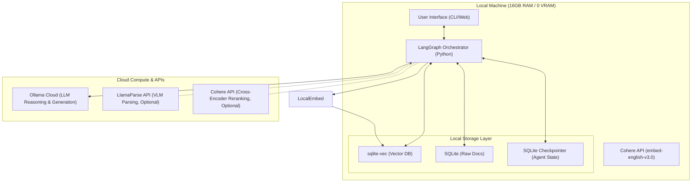

# Thin-Client Agentic RAG System (2026)


Welcome to the definitive architecture and implementation roadmap for an elite, high-performance **Agentic RAG System** designed for late-2026 deployment. 

This repository hosts a complete 7-phase system design and engineering blueprint optimized for constrained local hardware (**16 GB RAM / 0 VRAM / CPU-first architecture**) using the **Thin-Client Orchestration Pattern**.

---

## ✨ Key Features & Capabilities

*   **Multi-Modal Ingestion:** Seamlessly parses complex PDFs (pymupdf4llm + LlamaParse for scanned/complex), codebases (with AST extraction), and websites.
*   **Self-Correcting Agentic Loops:** Uses LangGraph to automatically critique and re-retrieve context if the first pass fails.
*   **Long-Term Memory:** Maintains a user-editable preference memory with optional chronological decay.
*   **Two-Stage Reranking:** Merges dense and sparse vectors locally, runs Local CPU FlashRank reranking, and allows an optional Cohere cross-encoder pass.
*   **Graceful Degradation:** On generation-API failure, it retries and then surfaces the ranked source evidence back to the user, preventing a crash while avoiding dangerous micro-model hallucinations.

---

## 🚀 The Thin-Client Paradigm

Running state-of-the-art vision parsers, heavy cross-encoder rerankers, or large reasoning LLMs locally on a CPU causes severe performance degradation, memory thrashing, and OS swapping. 

This system resolves those limitations by keeping **logic, routing, state, and vector databases local** while offloading heavy LLM reasoning and generation to **highly-responsive cloud APIs and Ollama Cloud**.



---

## 📂 Repository Contents

The design of the system is divided into 7 sequential phases:

| Phase / File | Title | Description |
| :--- | :--- | :--- |
| **Phase 1** | [State of the Art (2026)](./rag_state_of_the_art_2026.md) | Deep-dive research into 2026 RAG frontiers (Subquadratic architectures, late chunking, sparse/dense hybrid, CoALA agent memory). |
| **Phase 2** | [Initial Architecture](./rag_architecture_2026.md) | Draft layout of the ideal architecture, memory layouts, database considerations, and parsing techniques. |
| **Phase 3** | [Technology Stack](./rag_tech_stack_2026.md) | Definitive tech stack blueprint tailored precisely for 16GB RAM / 0 VRAM limits (Cohere API, `sqlite-vec`, Linear Pipeline). |
| **Phase 4** | [Final Architecture Maps](./rag_final_architecture_2026.md) | Detailed Mermaid blueprints covering system design, sequence data flow, memory hierarchies, ingestion pipelines, and agent communication. |
| **Phase 5** | [Implementation Roadmap](./rag_phase_5_implementation_roadmap_2026.md) | Step-by-step rollout plan (MVP to production-grade) highlighting critical evaluation metrics, latencies, and performance benchmarks. |
| **Phase 6** | [Architectural Self-Critique](./rag_phase_6_self_critique_2026.md) | Hard-nosed critique of potential bottlenecks, API dependencies, and complexity traps, presenting the **V2 Elite Pivot** optimizations. |
| **Phase 7** | [Technical Specification](./rag_phase_7_technical_specification_2026.md) | Complete implementation-grade engineering specification (folders, schemas, workers, router logic, memory engine rules, security, APIs). |

---

## 🛠️ The V2 Elite Architecture Highlights

The **V2 Architecture** (detailed in Phase 6 & Phase 7) resolves standard RAG failure points with:
1. **Two-Stage Reranking:** Rather than sending 100 chunks over the network to a cloud cross-encoder (which incurs massive API inference costs and latency), the system leverages a local CPU-bound `FlashRank` pass to trim down to 15 chunks before (optionally) calling the cloud reranker.
2. **Graceful Degradation:** The generation LLM is the only mandatory cloud call. If it times out or drops connection, the orchestrator routes the retrieved and ranked evidence directly back to the user instead of crashing.
3. **Confidence-Based Routing:** Simple conversational queries or highly-confident search matches bypass expensive multi-agent LangGraph cycles to save API costs and speed up CPU response times.
4. **Decoupled Asynchronous Ingestion:** An independent in-process background worker handles heavy PDF ingestion without blocking the main UI thread, pausing when active queries need CPU resources.

---

## ⚡ Technical Stack Summary

*   **Orchestrator:** LangGraph (cyclical, state-managed)
*   **Vector Database:** `sqlite-vec` (extremely lightweight, C-extension for SQLite)
*   **Keyword Search:** SQLite FTS5 (BM25)
*   **Embeddings:** `Cohere API` (embed-english-v3.0, high semantic quality)
*   **Parser:** pymupdf4llm (Local Markdown-aware Text) / LlamaParse API (Cloud VLM for complex markdown/tables)
*   **Reranker:** `FlashRank` (Local CPU Stage 1) + Cohere Rerank API (Cloud Stage 2, Optional)
*   **Primary LLM:** Ollama Cloud (Cloud)
*   **Agent State:** SQLite Checkpointer
*   **Long-Term Memory:** SQLite KV (Versioned preferences)

---

## 📋 Prerequisites

Before implementing the specification, ensure your local environment meets the following baseline requirements:
*   **Hardware:** 16 GB RAM, 500 GB SSD. (VRAM not required - CPU-first architecture).
*   **Software:** Python 3.11+, Git.
*   **API Keys Required:** Generation LLM API (e.g., Ollama Cloud, OpenAI, Anthropic).
*   *Optional API Keys:* Cohere API (precision reranking), LlamaParse (complex scanned PDFs).

---

## 📈 Next Steps: Implementation

To proceed to building this production-grade RAG agent, follow the domain-driven project structure specified in [Phase 7](./rag_phase_7_technical_specification_2026.md) and set up the local environment:

```bash
# Clone the repository
git clone https://github.com/dpsdagain/RAG.git
cd RAG

# Initialize local Python environment
python -m venv venv
source venv/bin/activate  # Or .\venv\Scripts\activate on Windows

# Initialize config
cp configs/config.example.yaml configs/config.yaml
```

Refer to [Phase 5](./rag_phase_5_implementation_roadmap_2026.md) for automated evaluation strategies using **Ragas** and latency testing criteria.
