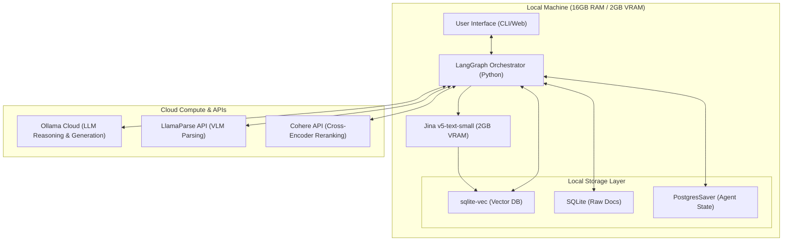

# Thin-Client Agentic RAG System (2026)

Welcome to the definitive architecture and implementation roadmap for an elite, high-performance **Agentic RAG System** designed for late-2026 deployment. 

This repository hosts a complete 7-phase system design and engineering blueprint optimized for constrained local hardware (**16 GB RAM / 2 GB VRAM / CPU-first architecture**) using the **Thin-Client Orchestration Pattern**.

---

## 🚀 The Thin-Client Paradigm

Running state-of-the-art vision parsers, heavy cross-encoder rerankers, or large reasoning LLMs locally on a 2GB VRAM machine causes severe performance degradation, memory thrashing, and OS swapping. 

This system resolves those limitations by keeping **logic, routing, state, and vector databases local** while offloading heavy matrix compute to **highly-responsive cloud APIs and Ollama Cloud**.



---

## 📂 Repository Contents

The design of the system is divided into 7 sequential phases:

| Phase / File | Title | Description |
| :--- | :--- | :--- |
| **Phase 1** | [State of the Art (2026)](./rag_state_of_the_art_2026.md) | Deep-dive research into 2026 RAG frontiers (Subquadratic architectures, late chunking, sparse/dense hybrid, CoALA agent memory). |
| **Phase 2** | [Initial Architecture](./rag_architecture_2026.md) | Draft layout of the thin-client architecture, memory layouts, database considerations, and parsing techniques. |
| **Phase 3** | [Technology Stack](./rag_tech_stack_2026.md) | Definitive tech stack blueprint tailored precisely for 16GB RAM / 2GB VRAM limits (Jina, `sqlite-vec`, LangGraph, Cohere, LlamaParse). |
| **Phase 4** | [Final Architecture Maps](./rag_final_architecture_2026.md) | Detailed Mermaid blueprints covering system design, sequence data flow, memory hierarchies, ingestion pipelines, and agent communication. |
| **Phase 5** | [Implementation Roadmap](./rag_phase_5_implementation_roadmap_2026.md) | Step-by-step rollout plan (MVP to production-grade) highlighting critical evaluation metrics, latencies, and performance benchmarks. |
| **Phase 6** | [Architectural Self-Critique](./rag_phase_6_self_critique_2026.md) | Hard-nosed critique of potential network bottlenecks, API dependencies, and complexity traps, presenting the **V2 Elite Pivot** optimizations. |
| **Phase 7** | [Technical Specification](./rag_phase_7_technical_specification_2026.md) | Complete implementation-grade engineering specification (folders, schemas, workers, router logic, memory engine rules, security, APIs). |

---

## 🛠️ The V2 Elite Architecture Highlights

The **V2 Architecture** (detailed in Phase 6 & Phase 7) resolves standard RAG failure points with:
1. **Two-Stage Reranking:** Rather than uploading 100 chunks over the network to Cohere (causing massive HTTP latency), the system leverages a local CPU-bound `FlashRank` pass to trim down to 15 chunks before calling the cloud reranker.
2. **Graceful Degradation:** A CPU-only `llama.cpp` instance running a heavily quantized 1.5B micro-model (e.g. Qwen2.5-1.5B) resides in local system RAM. If Ollama Cloud suffers latency or drops connection, the orchestrator routes to the local model to achieve 100% uptime.
3. **Confidence-Based Routing:** Simple conversational queries or highly-confident search matches bypass expensive multi-agent LangGraph cycles to save API costs and speed up response times.
4. **Decoupled Asynchronous Ingestion:** An independent background worker handles heavy PDF ingestion and LlamaParse webhooks without blocking the main UI thread.

---

## ⚡ Technical Stack Summary

*   **Orchestrator:** LangGraph (cyclical, state-managed)
*   **Vector Database:** `sqlite-vec` (extremely lightweight, C-extension for SQLite)
*   **Keyword Search:** SQLite FTS5 (BM25)
*   **Embeddings:** `Jina v5-text-small` (local, fits comfortably inside 2GB VRAM)
*   **Parser:** LlamaParse API (cloud VLM parsing for complex markdown/tables)
*   **Reranker:** `FlashRank` (Local Stage 1) + Cohere Rerank API (Cloud Stage 2)
*   **Primary LLM:** Ollama Cloud (Cloud) / Quantized local models on CPU (Fallback)
*   **Agent State:** `PostgresSaver` / SQLite Checkpointer
*   **Long-Term Memory:** Graphiti (Temporal Knowledge Graphs)

---

## 📈 Next Steps: Implementation

To proceed to building this production-grade RAG agent, follow the domain-driven project structure specified in [Phase 7](./rag_phase_7_technical_specification_2026.md) and set up the local environment:

```bash
# Clone the repository
git clone https://github.com/dpsdagain/RAG.git
cd RAG

# Initialize local environment & config
cp configs/config.example.yaml configs/config.yaml
```

Refer to [Phase 5](./rag_phase_5_implementation_roadmap_2026.md) for automated evaluation strategies using **Ragas** and latency testing criteria.
