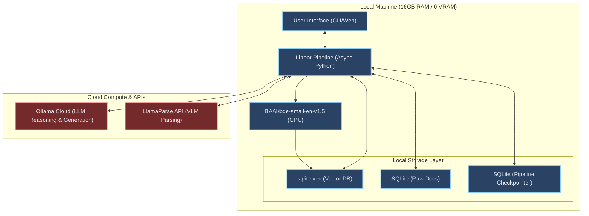
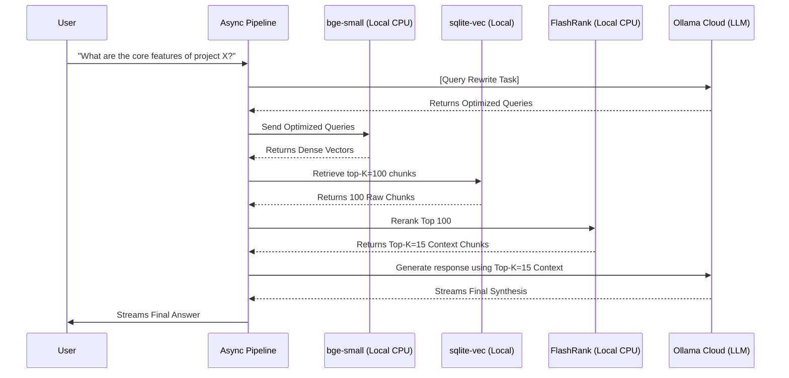
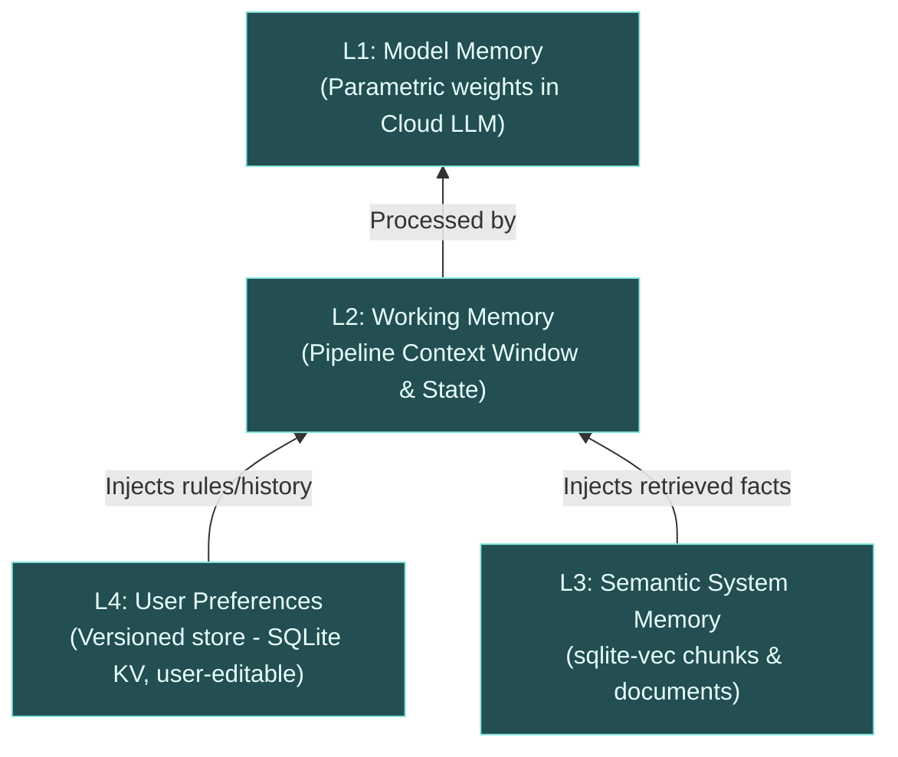
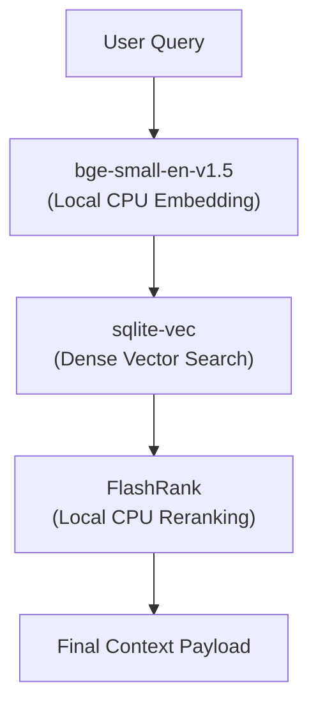
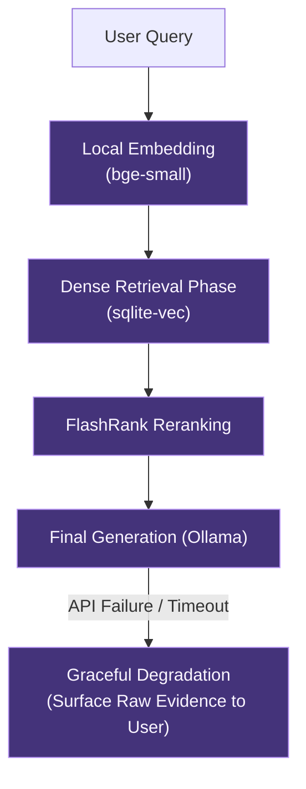
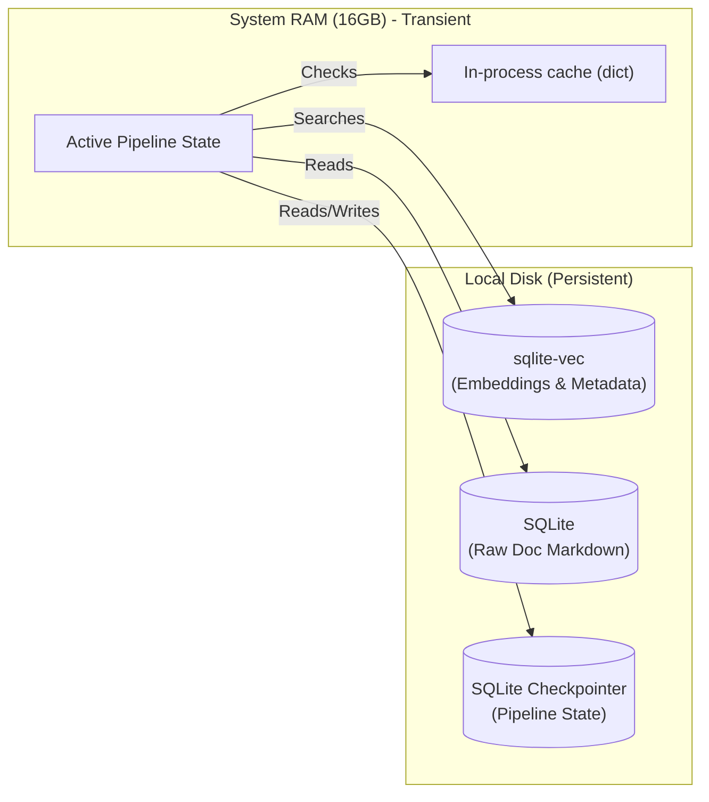

# Phase 4 — Final Architecture Maps
## Visual Blueprint for the 2026 Thin-Client RAG System

> [!NOTE]
> Below are the 7 requested architectural diagrams representing the definitive state of your 2026 personalized RAG system (0 VRAM / 16 GB RAM baseline). These diagrams map the "Thin-Client" paradigm, where heavy matrix compute is offloaded to the cloud, and local models are explicitly restricted to CPU execution.

---

### 1. Full System Architecture Diagram
*A high-level view of the entire local-to-cloud split architecture.*



---

### 2. Data Flow Diagram (Query Execution)
*How a user query travels from input to final synthesized response.*



---

### 3. Memory Hierarchy Diagram
*Visualizing the cognitive architecture for temporal and static memory.*



---

### 4. Retrieval Orchestration Diagram
*The logic gate for dynamic retrieval paths.*



---

### 5. Linear Pipeline Orchestration
*The brutalist linear pipeline replacing the cyclical multi-agent framework.*



---

### 6. Storage Architecture Map
*How data is physically stored locally vs transiently.*



---

### 7. Ingestion Pipeline Map
*How complex files are processed before hitting the database.*

```mermaid
graph TD
    Input["Raw Files<br>(PDF, DOCX, Code)"]
    
    Input --> PDFType{"Is PDF text-extractable?"}
    
    PDFType -->|Yes (Text)| ParserLocal["pymupdf4llm<br>(Local CPU Parsing)"]
    PDFType -->|No (Scanned/Complex)| ParserCloud["LlamaParse API<br>(Cloud VLM Extraction)"]
    
    ParserLocal --> Cleaner["Local Text Cleaner<br>(Regex / Normalization)"]
    ParserCloud --> Cleaner
    
    Cleaner --> SemanticChunking["Semantic Markdown Splitter"]
    
    SemanticChunking --> ChunkText["Context-Aware Chunks"]
    
    ChunkText --> BgeEmbed["bge-small-en-v1.5<br>(Local CPU Embedding)"]
    
    BgeEmbed -->|Dense Vectors| VecDB[("sqlite-vec")]
    ChunkText -->|Raw Text| SQL[("Document Store")]
    
    classDef pipe fill:#1a202c,stroke:#a0aec0,color:#f7fafc
    class Input,Cleaner,SemanticChunking,ChunkText,BgeEmbed pipe
```
