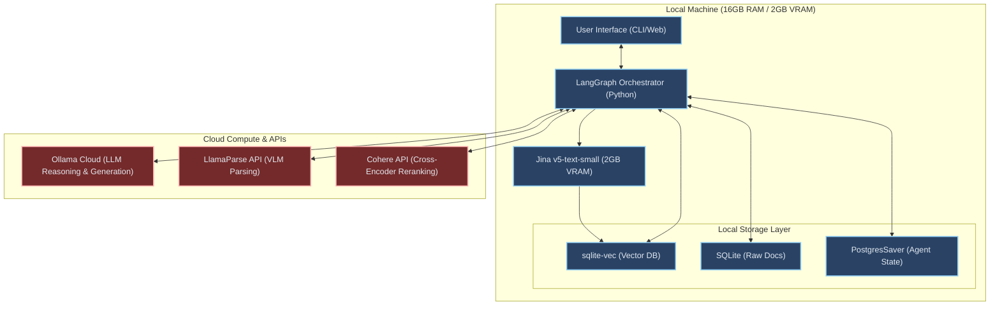
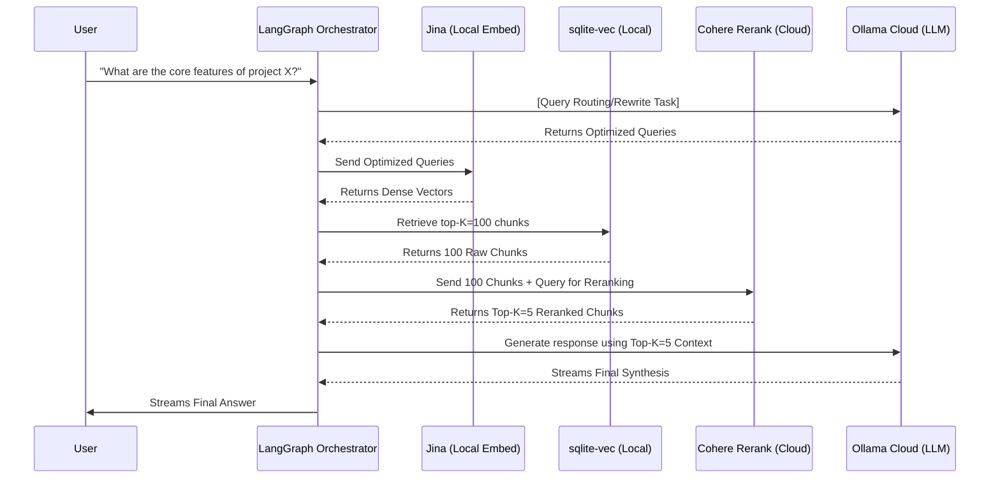
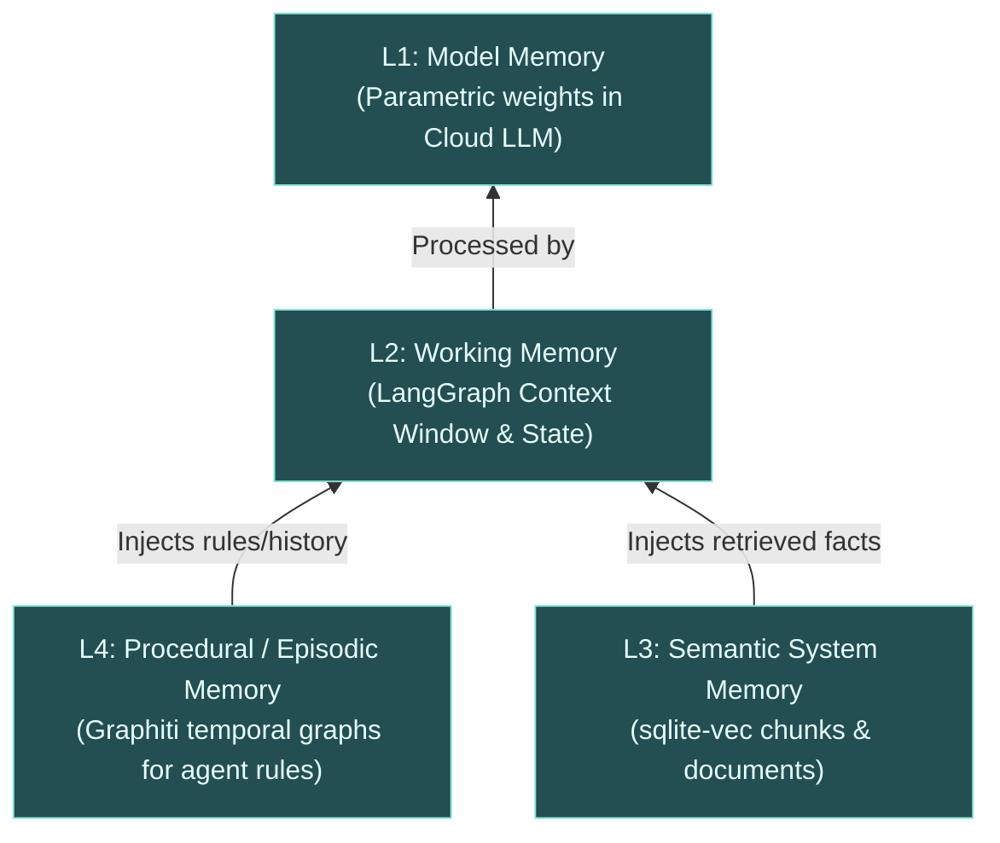
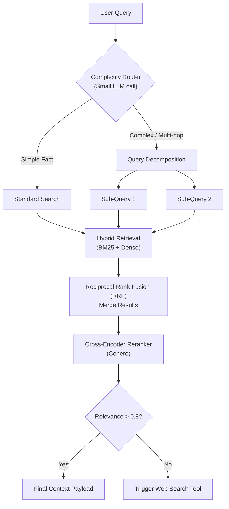
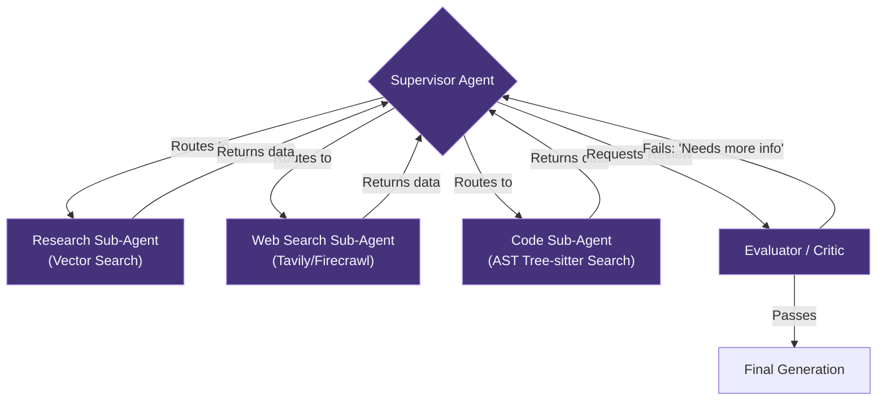
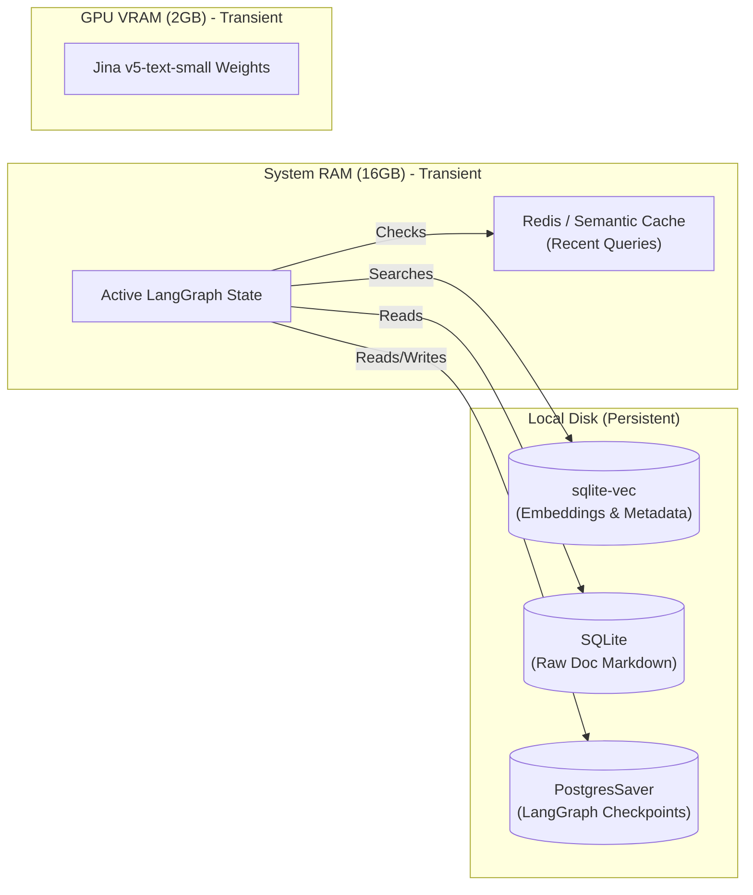
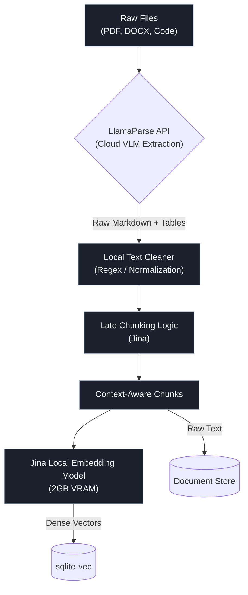

# Phase 4 — Final Architecture Maps
## Visual Blueprint for the 2026 Thin-Client RAG System

> [!NOTE]
> Below are the 7 requested architectural diagrams representing the definitive state of your 2026 personalized RAG system (16GB RAM / 2GB VRAM constraint). These diagrams map the "Thin-Client" paradigm, where orchestration runs locally but heavy matrix compute is offloaded to the cloud.

---

### 1. Full System Architecture Diagram
*A high-level view of the entire local-to-cloud split architecture.*

---

### 2. Data Flow Diagram (Query Execution)
*How a user query travels from input to final synthesized response.*

---

### 3. Memory Hierarchy Diagram
*Visualizing the CoALA cognitive architecture for temporal and static memory.*

---

### 4. Retrieval Orchestration Diagram
*The logic gate for dynamic retrieval paths.*

---

### 5. Agent Communication Flow
*The LangGraph cyclic state machine.*

---

### 6. Storage Architecture Map
*How data is physically stored locally vs transiently.*

---

### 7. Ingestion Pipeline Map
*How complex files are processed before hitting the database.*

