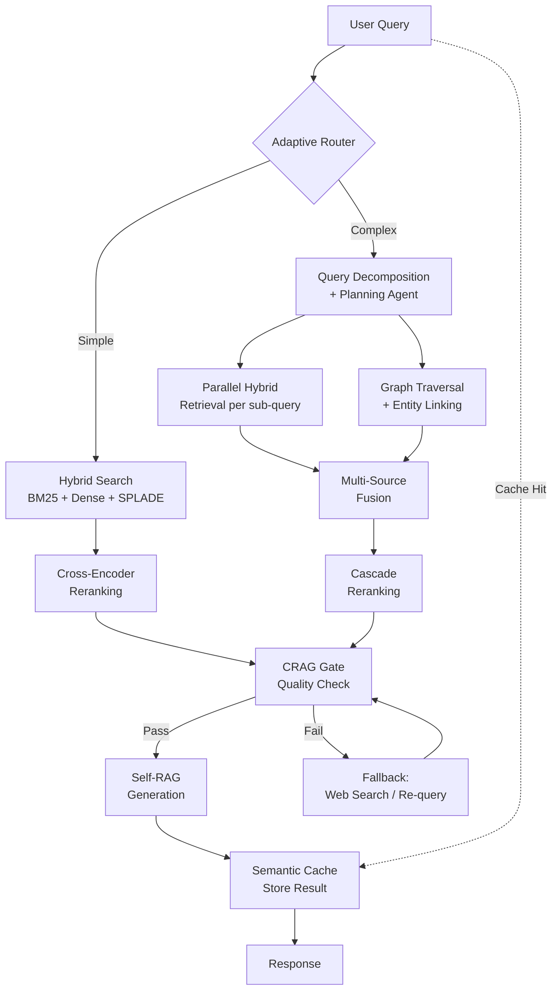
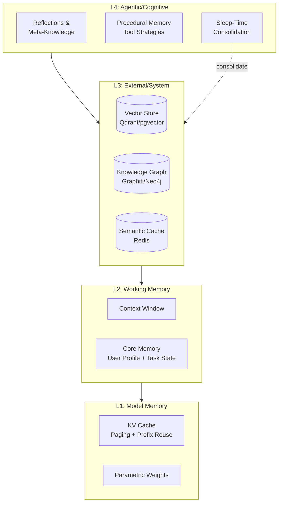

# Phase 1 — The State of RAG Systems in 2026
## A Principal Architect's Deep Research Report

> [!NOTE]
> This document synthesizes findings from 45+ targeted web searches conducted on May 26, 2026. It represents the current frontier of RAG system design — not beginner tutorials or toy demos. Every claim is grounded in published research, production reports, or framework documentation.

---

# Part I — Why Traditional RAG Fails

> **"72–80% of enterprise RAG projects experience critical failures or fail within the first year."**
> — Industry reports, 2025

The fundamental insight: RAG fails because teams treat it as **prompt engineering** when it is actually **information engineering**. The retriever provides irrelevant, incomplete, or poorly ranked context — and the LLM is only as good as what it receives.

---

## 1. Failure Modes of Naive Vector Search

**Root cause:** Single-vector embeddings face a mathematical hard ceiling for combinatorial retrieval tasks.

| Failure | Mechanism |
|---|---|
| **Similarity ≠ Relevance** | Vector search finds documents *semantically similar* to the query, not those that are *relevant* or *correct*. Produces "confidently wrong" retrieval. |
| **Information Loss** | Dense embeddings are lossy by design. They discard exact information (product IDs, legal codes, dates, SKUs) critical for precision. |
| **Combinatorial Collapse** | DeepMind (2025) showed single-vector embeddings cannot represent all possible combinatorial relationships (e.g., "compare A and B" or "find docs meeting criteria X, Y, and Z"). |
| **Asymmetric Matching** | Brief queries ("Q3 anomalies") paired with long, detailed documents create an unbridgeable semantic gap. |
| **No Structured Logic** | Standard vector search cannot natively handle Boolean logic, exact phrase matching, or complex filtering. |

> [!IMPORTANT]
> In very large datasets, the distance between random vectors **converges** (curse of dimensionality), making the embedding space "crowded" and destroying top-k precision. Any production system requiring precision will fail with vector-only search.

**The 2026 minimum:** Hybrid search (dense + sparse BM25) + cross-encoder reranking is now **mandatory** for production.

---

## 2. Retrieval Collapse (Semantic Collapse)

A geometric limitation of flat vector retrieval — not a software bug.

**The cliff:**
- At 1K–5K docs, semantically similar documents cluster together — retrieval works.
- At ~10K+ documents, the high-dimensional vector space becomes crowded.
- Points become equidistant, destroying discriminative power.

```
Precision at 10K documents:  ~95%
Precision at 100K documents: ~12%
                              ↑ catastrophic cliff
```

> [!CAUTION]
> The system continues returning answers (no error), creating **false confidence**. This is especially dangerous in legal, medical, and regulatory compliance domains.

**Mitigations:** Hierarchical retrieval (tree-based narrowing), hybrid search (dense + sparse + neural sparse), knowledge graphs (explicit relationship linking vs. geometric proximity), fine-tuned domain-specific models.

---

## 3. Context Poisoning

RAG systems implicitly trust retrieved documents as authoritative grounding — creating an exploitable attack surface.

**Attack vectors:**
- **Data Poisoning** — Injecting fabricated/misleading documents into the corpus
- **Retrieval Poisoning** — Manipulating retriever ranking without altering the knowledge base
- **Semantic Mismatch Attacks** — Crafting passages semantically distant in natural language but highly similar in embedding space (ACL research)
- **Topic-Oriented Manipulation** — *Topic-FlipRAG* influences model opinions across related queries by leveraging LLM reasoning chains
- **Multimodal Attacks** — *PoisonedEye* extends poisoning to Vision-Language RAG

> [!WARNING]
> Unlike prompt injection (transient), context poisoning is **persistent** — corrupted data influences all future queries. This is now an infrastructure-level security challenge.

**Defense:** *RAGuard* (NeurIPS) — two-step defense: fine-tuning retrievers to downrank malicious passages + zero-knowledge inference patches.

---

## 4. Embedding Drift

Gradual divergence between the stored vector space and incoming query embeddings.

**Three mechanisms:**

| Mechanism | Description |
|---|---|
| **Model Updates** | Switching embedding models reshapes vector space geometry. Mixing old/new embeddings in one index creates unpredictable retrieval. |
| **Semantic Shift** | Real-world meaning evolves (new terminology, shifting concepts). Stale embeddings no longer align with current user intent. |
| **Pipeline Desync** | Vector databases treated as "dumb storage" separate from content lifecycle. Source docs change but vectors don't. |

**Detection (2025 best practices):**
- Statistical monitoring: Population Stability Index (PSI), KL divergence, Jensen-Shannon divergence
- Distance tracking: Average cosine similarity vs. baseline
- Visual: UMAP/t-SNE/PCA for cluster migration
- "Golden Recall@K" tracking with stable query sets

**Key research:** *Drift-Adapter* (arXiv 2025) — maps new queries into legacy embedding space, avoiding full corpus re-indexing. Selective re-embedding: prioritize "hot" documents by TTL/click-through analytics.

---

## 5. Long-Context Degradation ("Lost in the Middle")

A structural limitation of transformer attention mechanisms and positional encodings (e.g., RoPE).

**The U-shaped recall curve:** LLMs excel at the **beginning** and **end** of prompts, but **lose information in the middle**.

> [!CAUTION]
> **NOT fixed by larger context windows** — actually *exacerbated*. Models with 1M+ token windows still show **20–50% performance degradation** when critical facts are mid-sequence. As context grows, irrelevant information dilutes signal even with perfect retrieval ("Context Rot").

**2026 mitigations:**
1. **Two-stage reranking** — broad retrieval (50–100 candidates) → cross-encoder filtering to top 5–10. Effectively "removes the middle."
2. **Strategic positioning** — place critical evidence at very beginning or very end of prompt.
3. **Context compaction** — summarize, deduplicate, remove redundancy.
4. **Multi-scale Positional Encoding (Ms-PoE)** — position-agnostic attention (emerging research).
5. **Recursive Language Models (RLMs)** — late 2025/early 2026; process long inputs recursively, treating context as external programmable object.

**Production principle:** *Quality of context > quantity of context.* The context window is a finite, expensive, fragile resource.

---

## 6. Chunking Failures

The most underestimated architectural decision in RAG. Teams treat it as preprocessing when it's a **fundamental design choice**.

| Failure Pattern | Description |
|---|---|
| **Fragmentation of Meaning** | Fixed-size chunking (512 tokens) splits mid-sentence, separates policy rules from exceptions, breaks tables. |
| **Context Loss** | Small chunks lose surrounding information (dangling pronouns, missing referents). Large chunks dilute semantic signal. |
| **Structure Destruction** | Flattening PDFs/HTML/reports into raw text blobs strips headers, tables, hierarchy. |
| **One-Size-Fits-All** | Same chunking logic for technical manuals, legal contracts, and logs. |

**2026 strategic shifts:**

| Strategy | Benefit |
|---|---|
| **Semantic Chunking** | Groups by meaning, not token count; self-contained units |
| **Hierarchical Chunking** | Multiple granularity levels (sentences, paragraphs, sections) |
| **Parent-Context Chunking** | Small chunks for retrieval precision, inject full parent paragraph to LLM |
| **Layout-Aware Parsing** | Preserves tables, headers, reading order |
| **Late Chunking** | Embed entire document first, then pool token-level embeddings into chunks — retains global context |

---

## 7. Hallucination Despite Retrieval

RAG reduces hallucinations but does **NOT** eliminate them.

**Retrieval-side causes:**
- Unreliable/outdated source data
- Dense search retrieving semantically similar but factually irrelevant docs
- Query ambiguity leading to wrong intent detection
- Chunking destroying semantic context

**Generation-side causes:**
- **Parametric Override** — LLM's pre-trained knowledge conflicts with retrieved context; model prioritizes memorized patterns over grounding
- **Lost-in-the-Middle** — key facts buried in context are ignored
- **Fluency Over Accuracy** — models "hallucinate to fill gaps" rather than abstaining
- **Cross-Document Synthesis Failure** — misalignment when synthesizing across multiple retrieved docs

> [!WARNING]
> Even with *perfect* retrieval, models hallucinate if context is not *sufficient* to answer the query. Most systems lack **abstention mechanisms**. Paradoxically, some newer reasoning models show *higher* hallucination rates on specific tasks (over-analysis with noisy/conflicting input).

**Target:** <5% hallucination rate; faithfulness below 70% is considered **unsafe**.

---

## 8. Agent Memory Corruption

Two distinct failure modes — **security attacks** and **architectural degradation**.

**Memory Poisoning (Security):**
- Embeds malicious instructions in persistent memory (vector DBs, conversation logs)
- Agent recalls and acts on corrupted context in future interactions
- Creates **self-validating feedback loops** — agent reinforces its own incorrect state
- **Success rates exceeding 80%** — significantly higher than single-turn prompt injection

**Memory Degradation (Architectural):**
- **"Consolidated Memory" Trap** — LLM periodically rewrites past interactions into summaries ("lessons learned"). Research (mid-2026) shows this process *introduces inaccuracies* — agent becomes "dumber" as memory grows.
- **Operational Blind Spots** — Most frameworks lack interfaces for inspecting, editing, or rolling back memory state.
- **Memory Leaks** — Agents accumulate irrelevant/outdated data → slower performance, unexpected behavior, increased token costs.

---

## 9. Multi-Hop Retrieval Problems

Traditional RAG treats knowledge as a "bag of isolated chunks" — fundamentally incompatible with reasoning chains.

| Failure Mode | Description |
|---|---|
| **Disconnected Chunks** | Answering requires connecting "Alice→Bob" (Chunk 1) to "Bob→Charlie" (Chunk 2). Standard retrieval searches for similarity to the *query*, not the *reasoning chain*. |
| **Error Propagation** | Error in first retrieval hop cascades; subsequent steps rarely self-correct. |
| **Context Fragmentation** | Even with all relevant chunks retrieved, LLMs struggle to "anchor, merge, and sequence" logic across them. |
| **Open-Loop Pipelines** | No validation whether retrieved information is sufficient before generating. |

```
Multi-hop accuracy (traditional RAG):     ~23%
Multi-hop accuracy (GraphRAG/Agentic RAG): ~87%
                                           ↑ 3.8x improvement
```

**Emerging solutions:** GraphRAG (explicit relationship traversal), PAR-RAG (Plan-and-Revise iterative retrieval), RAS (Retrieval & Structuring intermediate phase), *Anchor Carry-Drop* metric for tracking entity preservation across reasoning hops.

---

## 10. Knowledge Freshness Problems

RAG systems become "ignorant" of recent changes when vector indexes are not synchronized with source data.

**2025 production standard:**
- **Incremental/Delta Indexing** — Identify changed data via content hashes/timestamps; update only affected chunks
- **Layered Knowledge Base** — Core layer (stable) + real-time layers (dynamic: policies, pricing, news) with different update SLAs
- **Temporal Metadata & Decay Scoring** — Attach `scraped_at`, `effective_date` to every chunk; older info loses ranking weight
- **Canonical Source of Truth** — Authoritative data store separate from vector index
- **Re-embedding Trigger** — Recommended when **10–15%** of corpus changes

---

## 11. Latency Bottlenecks

Naive "retrieve-then-generate" monoliths accumulate latency across every stage.

**Highest-impact optimizations:**
1. **Semantic Caching** — Cache embeddings, retrieval results, or full LLM responses for similar queries → **sub-100ms** returns
2. **Adaptive RAG (Query Routing)** — Lightweight classifier routes simple queries to fast retrieval, complex to expensive agentic/GraphRAG
3. **Two-Stage Reranking** — Fast lightweight first pass, expensive cross-encoder only on top candidates
4. **ColBERT / Late Interaction** — Cross-encoder accuracy at bi-encoder speeds
5. **Prompt Caching** — Provider features (Anthropic, OpenAI) cache long system prompts
6. **Scope Reduction** — Metadata filtering before vector search to reduce scan space

**Target:** 1.5–3s end-to-end; semantic caching achieves sub-100ms for similar queries.

---

## 12. Cost Bottlenecks

Cost explosion at scale driven by embedding generation, vector DB compute, and LLM token usage.

**Cost distribution:** LLM synthesis ≈ **89%** of total spend.

| Optimization | Impact |
|---|---|
| **Quantization** | Product Quantization compresses embeddings 4–8x with negligible accuracy loss |
| **Two-Tier Storage** | Hot (top 20% in-memory) / Cold (cheaper storage) |
| **Right-Sized Dimensions** | 384-d or 768-d often match 1536-d for domain tasks |
| **Batch Embedding** | 100–500 texts per API call (never embed individually) |
| **Smart Model Routing** | Cheap models for simple queries, premium for complex |
| **HNSW Tuning** | Reducing `ef_search` to minimum threshold cuts per-query compute **40–70%** |

---

## 13. Scaling Bottlenecks

| Challenge | Description |
|---|---|
| **Accuracy degradation** | Precision loss at millions of documents (needle-in-haystack intensifies) |
| **Infrastructure** | Multi-stage pipelines introduce network round trips; sub-100ms with billions of vectors requires distributed HNSW/IVF |
| **Cost linearity** | Complex queries trigger multiple retrieval calls, costs multiply linearly |
| **Governance** | Row-Level Security, PII redaction, audit trails add complexity not natively supported by vector DBs |
| **Freshness at scale** | Real-time index updates while maintaining availability |

---

## Quantitative Summary of Failure Modes

| Metric | Value |
|---|---|
| Enterprise RAG failure rate (year 1) | 72–80% |
| Precision drop (10K → 100K docs) | 95% → 12% |
| Multi-hop accuracy (naive RAG) | ~23% |
| Multi-hop accuracy (GraphRAG) | ~87% |
| Memory poisoning success rate | >80% |
| Long-context perf degradation (mid-sequence) | 20–50% |
| LLM synthesis cost share | ~89% of total |
| HNSW `ef_search` tuning savings | 40–70% compute reduction |
| Caching latency/cost savings | 50–80% reduction |
| Re-embedding trigger threshold | 10–15% corpus change |

---

---

# Part II — Modern RAG Patterns (2026 State of the Art)

> **The frontier RAG system in 2026 is not a pipeline — it is an orchestrated, agentic, multi-stage reasoning system.**

---

## 1. Hybrid Retrieval (Sparse + Dense Fusion)

Combines BM25/keyword-based sparse retrieval (exact matching) with dense vector embeddings (semantic matching). Results merged via fusion algorithms.

**Key fusion techniques:**

| Technique | Description | When to Use |
|---|---|---|
| **Reciprocal Rank Fusion (RRF)** | Aggregates rank positions (not raw scores). Default k=60. Zero-config. | Starting point; no labeled data |
| **Weighted Score Fusion** | Normalizes scores, applies weight α. More effective with tuning. | When you have labeled relevance data |
| **Cross-Encoder Reranking** | Hybrid as stage-1 candidate gathering → cross-encoder stage-2. | Production systems requiring precision |

**Impact:** Production systems report **15–30% recall improvements** and marked hallucination reduction.

**2026 trends:**
- Learned sparse retrievers (**SPLADE**) gaining adoption over raw BM25 — transformer-based models that learn importance weights, performing automatic query expansion ("car" → "vehicle," "automobile")
- **ColBERT-style late interaction** emerging as a "third pillar"
- Native hybrid search in Qdrant, Weaviate, Elastic, MongoDB with built-in fusion
- Teams now analyze "retrieval splits" — query distributions to determine keyword vs. semantic weighting

---

## 2. Graph RAG

**Architecture (Microsoft):**
1. **Ingestion:** LLM parses raw text → extracts entities, relationships, claims
2. **Graph Construction:** Entities/relationships mapped into a knowledge graph
3. **Community Hierarchies:** Graph clustered using **Leiden algorithm** → each community summarized by LLM
4. **Retrieval Modes:**
   - **Local Search:** Entity-based subgraph retrieval for targeted questions
   - **Global Search:** Pre-generated community summaries for corpus-wide themes

**Why it matters:** Enables multi-hop reasoning, relationship discovery, and global corpus summarization that flat vector search cannot achieve. Critical for "connect-the-dots" questions spanning disparate documents.

**Key developments:**
- **LazyGraphRAG:** Reduces indexing costs by **~99.9%** (original cost ~$33K for large datasets) while maintaining query performance
- **Agentic integration:** Agents dynamically choose between vector search (speed) and graph traversal (complex multi-hop)
- **Alternative frameworks:** HippoRAG, PathRAG, LightRAG — various cost/quality tradeoffs
- **Skeleton-Based Construction:** Extract core entities only for high-importance data — lightweight methods for the rest

> [!TIP]
> **Use GraphRAG for** complex multi-document summarization, multi-hop reasoning, relationship discovery.
> **Avoid for** simple factual queries where vector search is faster/cheaper.

---

## 3. Agentic RAG

The LLM acts as an active controller within an agentic loop (ReAct pattern). Retrieval becomes a **tool call** — the agent can re-query, critique findings, and decide when it has sufficient information.

**Core components:**
1. **Orchestration Layer** — Planning, task delegation, state persistence (LangGraph)
2. **Specialized Agent Layer** — Agents scoped to tasks (vector DB, web search, code execution)
3. **Retrieval & Hybrid Search** — BM25 + dense + cross-encoder as standard
4. **Governance & Safety** — Inline hallucination guardrails, LLM-as-a-judge evaluation gates
5. **Standardized Protocols** — Model Context Protocol (MCP) for agent-data-source interoperability

**Performance:**
```
Traditional RAG accuracy (complex tasks): 70–80%
Agentic RAG accuracy (same tasks):        90–95%
```

> [!IMPORTANT]
> **The most important production pattern for 2026 — Adaptive RAG:**
> A query classifier routes simple queries to fast standard retrieval, complex multi-hop queries to full agentic workflows. Balances cost/latency with accuracy. Without this, you're either overspending on simple queries or underperforming on complex ones.

**Tradeoffs:** Slower (5–15s vs <1s), more expensive (multiple LLM calls per query). The adaptive router is what makes this viable.

---

## 4. Multi-Stage Reranking

**Standard 3-stage pipeline (2026 production norm):**

| Stage | Method | Goal | Scale |
|---|---|---|---|
| **Stage 1** | Hybrid Search (Dense + BM25) | Cast wide net, optimize recall | 50–200 chunks |
| **Stage 2** | Cross-Encoder Reranking | Deep query-dependent relevance, optimize precision | Top 20–50 |
| **Stage 3** | LLM Generation | Generate grounded response | Top 3–10 |

**Why cross-encoders are critical:** Unlike bi-encoders, they concatenate query + document for full attention. Captures nuance, negations, complex semantics. **10–25% precision improvement**, significant hallucination reduction.

**Advanced patterns:**
- **Two-Stage Cascade Reranking:** Fast lightweight cross-encoder (TinyBERT) prunes → heavy model or LLM-judge for final selection
- **Query-Dependent Routing:** Simple queries skip reranking; complex queries get deeper treatment
- **Batch Reranking:** Pack multiple candidates into single prompt for near-reranker quality at fraction of cost

---

## 5. ColBERT-Style Late Interaction Retrieval

Maintains **multi-vector, token-level representations** for documents. During scoring, performs fine-grained token-level matching (MaxSim operation).

**Why it's a breakthrough:**
- Bridges accuracy of cross-encoders with efficiency of bi-encoders
- Token-level grounding reduces hallucination
- Captures nuanced relationships that single-vector bi-encoders miss

**2026 ecosystem:**
- **PyLate library** (2025) — makes training/indexing/serving late-interaction models practical
- Surge in domain-specific ColBERT variants (German, Turkish, biomedical)
- Often used as "third pillar" alongside BM25 + dense
- **ColBERTv2:** Denoised supervision + residual compression for production

---

## 6. Adaptive / Semantic Chunking

| Technique | How It Works | Best For |
|---|---|---|
| **Embedding-First Semantic** | Embed all sentences → calculate inter-sentence similarity → boundaries where similarity drops | Prose, articles |
| **Late Chunking** | Embed entire doc with long-context model → mean-pool token embeddings within boundaries | Context-rich documents |
| **Recursive Semantic (RSC)** | Recursively split large chunks, merge small ones for semantic + size compliance | Mixed content |
| **Agentic Chunking** | AI agent analyzes structure/density → dynamically decides splitting strategy | Heterogeneous corpora |

**Intrinsic metrics:** Intrachunk Cohesion, Document Contextual Coherence — for tuning chunkers to specific data.

---

## 7. Small-to-Big Retrieval

Decouples search (small units for precision) from synthesis (big context for coherence).

**Two primary techniques:**

| | Parent Document Retrieval | Sentence Window Retrieval |
|---|---|---|
| **Granularity** | Chunk-level (paragraphs/sections) | Sentence-level |
| **Context** | Broader section-based context | Local neighboring-sentence context |
| **Goal** | Connect specific facts to broader themes | Maintain coherence around specific details |
| **Best For** | Facts embedded within thematic paragraphs | Resolving pronouns, local references |

**Architecture:** Split docs into large "parent" chunks → subdivide into "child" chunks → embed only children → retrieve child → fetch parent for LLM.

---

## 8. Query Planning & Decomposition

Breaks complex, multifaceted queries into atomic sub-queries. Each triggers independent, targeted retrieval. Results merged, deduplicated, reranked, synthesized.

**Standard pipeline:**
1. **Decomposition:** LLM generates atomic sub-queries
2. **Retrieval:** Parallel retrieval per sub-query (hybrid search)
3. **Deduplication & Reranking:** Merge, deduplicate, rerank with cross-encoder
4. **Synthesis:** LLM generates final response from refined evidence

**2026 innovations:**
- **Planner Agents:** Dynamic decomposition based on query complexity
- **Multi-Armed Bandit Policies:** Balance exploration (broad sub-queries) vs. exploitation (focusing on promising documents)
- **Integration with GraphRAG:** Decomposition handles "what" pieces; GraphRAG provides structural "how" (entity relationships)

---

## 9. Semantic Caching

**Multi-tier caching strategy:**

| Tier | Level | What's Cached | Impact |
|---|---|---|---|
| **Tier 1** | Query-Level | Near-identical intent → cached full response | Front-end intercept |
| **Tier 2** | Context-Level | Frequently accessed chunks, retrieval results | Avoids redundant vector DB searches |
| **Tier 3** | Response/Partial | Agentic tool results, partial completions | Short-circuits reasoning chains |

**Performance:**
- Up to **90% cost reduction** in API token consumption
- **15x–65x speed improvement** on cache hits
- No application code changes needed (gateway-level integration)

**Tools:** Redis (with LangCache), Pinecone, Weaviate, Qdrant, Chroma.

---

## 10. Reflective / Corrective RAG

### Corrective RAG (CRAG)
Quality gate **between** retrieval and generation:
- **Correct:** High-quality docs → use for generation
- **Incorrect:** Unreliable docs → discard, trigger fallback (web search)
- **Ambiguous:** Blend retrieved knowledge with external search results

### Self-RAG (Self-Reflective)
Self-awareness **embedded** in the LLM via reflection tokens:
- `[Retrieve]` — model decides if external retrieval needed
- `[IsRelevant]` — evaluates document relevance
- `[IsSupported]` — checks if generation is evidence-supported
- `[IsUseful]` — assesses output quality

| Feature | CRAG | Self-RAG |
|---|---|---|
| **Focus** | Retrieval quality (before generation) | Reasoning quality (during/after generation) |
| **Mechanism** | External evaluator middleware | Reflection tokens in LLM |
| **Advantage** | Robust handling of noisy data | Adaptive, verifiable generation |

**2026 best practice:** Combine both — CRAG ensures high-quality context, Self-RAG ensures accurate reasoning.

---

## 11. Streaming Ingestion Pipelines

Event-driven, incremental pipelines that update vector indices the moment source data changes.

**Core components:**
1. **Source Connectors:** CDC tools (Debezium) capture row-level changes from databases
2. **Stream Processing:** Apache Flink, Kafka Streams, RisingWave — chunking, filtering, embedding, PII masking
3. **Embedding Engine:** Native embedding functions within streaming DBs
4. **Vector Database (NRT):** Milvus, Qdrant, Weaviate support near-real-time upserts/deletes

**Key strategies:**
- **Hybrid Batch-and-Streaming:** Historical data via batch, new data via streaming
- Only re-embed **specific changed chunks**, not full documents
- Attach source provenance, timestamps, ACLs at ingestion time
- Real-time monitoring of ingestion latency, retrieval hit-rates, embedding costs

---

## 12. Self-Healing Indexes

- **Asynchronous Rebalancing:** Builds/updates HNSW or ScaNN indexes in background — query performance uninterrupted
- **Automatic Tuning:** Analyzes workload statistics → adjusts partition sizes, centroid updates based on data distribution shifts
- **Self-Correction:** Detects when index needs rebuild → triggers automatically

**Key advancement — Auto-Index:** Google Cloud AlloyDB AI introduced auto vector index that self-configures and maintains incrementally as data changes. Eliminates DBA expertise for nlist/nprobe tuning at billion-vector scale.

---

## 13. Tool-Augmented Retrieval

Retrieval is just another **tool** alongside calculators, APIs, code execution, web search. Agents dynamically select the right tool based on task context.

**Key pattern — Retriever-Augmented Selection:** Instead of presenting all tools to an agent (choice paralysis), dynamically retrieve only the most relevant tools based on current task.

**Convergence:** The line between RAG (accessing information) and tool use (executing actions) has blurred. Both are unified under agentic orchestration. **Model Context Protocol (MCP)** standardizes communication.

---

## 14. Retrieval Orchestration

Modular, complexity-aware routing that dynamically manages heterogeneous data sources.

| Strategy | Description | Best Use |
|---|---|---|
| **Reciprocal Rank Fusion** | Merges ranked lists without normalized scores | Combining sparse/dense modalities |
| **Late Fusion (Meta-Ranking)** | Independent retrievers → combined and re-ranked | High-stakes source-level control |
| **Early Fusion** | Merges modalities at indexing stage (shared space) | Multi-modal text + images |
| **Confidence-Aware Fusion** | Adjusts weight based on retrieval confidence | Heterogeneous source reliability |

> [!TIP]
> **Evidence Adjudication** — evaluate and filter evidence BEFORE generation. Blindly concatenating chunks is no longer acceptable in 2026. Metrics have shifted to Evidence Precision, Abstain Rate, and MRR.

---

## 15. Hierarchical Indexing

Organizes data into multi-level structures (documents → sections → paragraphs → chunks). Top-down retrieval: search higher-level nodes first, drill down to fine-grained chunks.

**Key techniques:**
- **Graph-Enhanced Hierarchies:** ArchRAG, HiRAG combine hierarchical indexing with knowledge graphs
- **Recursive/Tree-Based Chunking:** KohakuRAG uses four-level tree with bottom-up embedding aggregation
- **Multi-Representation Indexing:** Different embeddings for same content (lightweight summary for fast retrieval, dense for detailed)
- **Hierarchical-Thought Instruction Tuning (HIRAG):** Trains models to filter, combine, and reason across evidence levels

---

---

# Part III — Memory Systems Architecture

> **The frontier AI system in 2026 treats memory as a first-class architectural concern — not an afterthought bolted onto a chatbot.**

---

## 1. The Four-Layer Memory Hierarchy

| Layer | Name | Function | OS Analogy |
|---|---|---|---|
| **L1** | Intrinsic/Model Memory | Parametric weights + KV cache (paging, fragmentation mgmt, prefix reuse) | CPU Cache |
| **L2** | Working Memory | Context window — SSMs (Mamba, Jamba) or hybrid architectures for sub-quadratic scaling | RAM |
| **L3** | External/System Memory | RAG + vector stores + knowledge graphs for cross-session recall | Disk |
| **L4** | Agentic/Cognitive Memory | Metacognitive memory (reflections), procedural memory (action sequences, tool-use strategies) | Operating System |

---

## 2. Episodic vs Semantic vs Procedural Memory

The standard taxonomy (CoALA Framework) now has **4 memory types:**

| Memory Type | Contents | Persistence | Retrieval |
|---|---|---|---|
| **Working** | Current goals, real-time state, scratchpad | Ephemeral (session) | Immediate (in-context) |
| **Episodic** | Past experiences with "what, where, when, why" | Persistent (cross-session) | Associative search |
| **Semantic** | Factual knowledge, concepts, relationships | Persistent (long-term) | Structured query + similarity |
| **Procedural** | Behavioral rules, skill templates, tool strategies | Persistent (evolving) | Pattern matching |

**Key innovations:**
- **Dual-Process Architectures:** Synchronous retrieval (immediate) decoupled from asynchronous consolidation (periodic summarization of episodic traces into semantic knowledge)
- **Dynamic Knowledge Graphs (Synapse, AriGraph):** Relevance via spreading activation, lateral inhibition, temporal decay — not just vector similarity
- **Event Segmentation:** Bayesian surprise detection segments info into coherent "episodes" in real-time

---

## 3. Temporal Memory

### Graphiti (by Zep) — The Leading Temporal Knowledge Graph Engine

**Bi-temporal model:**
- **Event Time:** When a fact was true in reality
- **Ingestion Time:** When the agent learned it
- Every edge has `valid_from` and `valid_to` validity windows

**Three-layer hierarchy:**
1. **Episodic Subgraph:** Raw events and messages (ground truth)
2. **Semantic Entity Subgraph:** Extracted entities and relationships
3. **Community Subgraph:** Clusters with high-level summaries (bird's-eye view)

**Performance:**
- Incremental real-time updates (no full-graph recomputation)
- Hybrid search: semantic embeddings + BM25 + graph traversal
- Sub-200ms to 300ms query latency
- SOTA on Deep Memory Retrieval (DMR) and LongMemEval benchmarks

---

## 4. MemGPT / Letta — The "LLM OS"

### Three-Tier Memory Hierarchy

| Tier | OS Analogy | Role |
|---|---|---|
| **Core Memory** | RAM | Always in-context; user profiles, current task state |
| **Recall Memory** | Disk Cache | Searchable recent conversation history |
| **Archival Memory** | Cold Storage | Long-term semantic search for domain knowledge |

### 2025–2026 Evolution
- **Agent Runtime:** Full OS-like environment — agent loop, tool execution, state persistence
- **MemFS:** Git-backed filesystem for memory — file-based operations, versioning
- **Sleep-Time Compute / "Dreaming":** Background reflection subagents consolidate learnings, tidy context when idle
- **Self-Managing Memory:** Agent decides what to remember, forget, and update via tool calls

### Letta vs Mem0

| | Mem0 | Letta |
|---|---|---|
| **Philosophy** | "Bolt-on" memory layer | "OS-like" runtime |
| **Memory Strategy** | Passive extraction | Active self-editing via tool calls |
| **Architecture** | Vector + Graph + KV hybrid | Core/Recall/Archival tiers |
| **Best For** | Adding personalization to existing apps | Building autonomous, long-lived stateful agents |

---

## 5. Memory Compression Strategies

### Summarization-Based
- **Rolling/Recursive Summarization:** Condense older history, keep recent turns verbatim
- **Structured Summaries:** Force into schemas (action items, facts, decisions)

### Token-Level (LLMLingua Family)
- Small LM scores tokens by entropy/perplexity → low-info tokens stripped
- **LLMLingua-2:** Bidirectional context, 3x–6x faster
- Up to **20x compression** achievable but lossy for chain-of-thought

### KV Cache Compression
- **KVzip:** Query-agnostic reconstruction — identifies vital KV pairs
- **Cascading KV Cache:** Tiered sub-caches based on exponential moving averages of attention scores
- **Dynamic Memory Compression (DMC):** Adaptive merge/discard during inference

### Adaptive Compression
- Triggered only when context exceeds ~80% capacity
- **Observation Masking:** Hiding older info without summarizing — effective for coding agents

---

## 6. Context Distillation — Evolution

| Phase | Focus | Key Technique |
|---|---|---|
| **2024 (Naive)** | Retrieval Recall | Embedding + Similarity Search |
| **2025 (Refinement)** | Precision & Noise Reduction | Re-ranking + Prompt Compression |
| **2026 (Production)** | Context Engineering | Agentic Retrieval + Rationale Distillation |

**Key technique — RADIO Framework:** LLMs extract explicit reasoning paths for *why* a document is relevant — aligns reranker and generator preferences, reducing hallucinations.

---

## 7. Recursive Summarization — RAPTOR

**RAPTOR (ICLR 2024 — foundational):**
1. Chunk document
2. Cluster chunks by semantic similarity (not position)
3. Summarize each cluster
4. Recursively cluster + summarize → tree structure
5. Retrieve from ANY level at query time

**Result:** +20% absolute accuracy on QuALITY benchmark with GPT-4.

**Key Innovation — xMemory:** Disentangles long dialogue histories into semantic units organized hierarchically — solves "collapsed similarity" problem where standard retrieval returns too many near-duplicate chunks.

---

## 8. Sleep-Time Compute / "Digital Sleep"

Inspired by human neuroscience — agents consolidate memory during idle time:

| Phase | Function |
|---|---|
| **Light Sleep** | Scan recent traces, remove duplicates |
| **Deep Sleep** | Filter for durable information, discard noise/stale facts |
| **REM Sleep** | Identify hidden cross-session patterns, generate reflective summaries |

Transforms episodic experiences into semantic rules (generalizable knowledge). Prevents memory bloat and context pollution.

---

## 9. A-MEM (Agentic Memory — NeurIPS 2025)

Zettelkasten-inspired self-evolving memory:
- **Note Construction** → **Link Generation** (causal/thematic/logical) → **Memory Evolution** (system updates itself when new info conflicts)
- More efficient than baseline vector-store retrieval by reducing noise
- Agents autonomously create structured notes with metadata, establish causal/thematic links, trigger memory evolution on conflict

---

## 10. Google Titans Architecture

**Three-memory system:**
- **Short-term:** Attention mechanism
- **Long-term:** Neural memory module — MLP that **updates its own weights during inference**
- **Persistent:** Learnable data-independent parameters

**Surprise-based memorization:** Gradient-based "surprise metric" prioritizes novel/pivotal information. Scales beyond 2M tokens without retraining.

**MAC variant:** Memory retrieved *before* attention runs, letting attention decide relevance dynamically.

---

---

# Part IV — The 2026 Component Stack

---

## Embedding Models (State of the Art)

| Model | Type | Key Strength |
|---|---|---|
| **Microsoft Harrier-OSS-v1 (27B)** | Open Source | SOTA multilingual |
| **Gemini Embedding 2** | Commercial | Best multimodal (text, image, audio, PDF) |
| **Jina v5-text-small** | Open Source | Best quality-to-size ratio |
| **Qwen3-Embedding-8B** | Open Source | Leading open-weight multilingual retrieval |
| **Voyage 4 Large** | Commercial | Optimized for shared embedding spaces/RAG |

**Key trends:**
- **Multimodal embeddings:** Text, images, video, audio, PDFs in single vector space (Gemini Embedding 2)
- **MTEB v2:** New benchmark — v1 scores not comparable. Prioritize **Retrieval** and **STS** metrics over overall average
- **Matryoshka Representation Learning (MRL):** Generate high-dim (1024/3072), truncate to lower (256/512) with minimal loss

---

## Reranker Models (State of the Art)

| Model | Best For | Notable |
|---|---|---|
| **Qwen3-Reranker-4B/8B** | General-purpose SOTA | 32k context, multilingual, MTEB-R leader |
| **NVIDIA nv-rerankqa-mistral-4b-v3** | High-accuracy QA RAG | Highly optimized for QA |
| **Cohere Rerank v4.0 Pro** | Enterprise/managed | Supports JSON, metadata-rich objects |
| **GTE-Reranker-ModernBERT-Base** | Latency-sensitive (149M params!) | Matches 1B+ models' accuracy |
| **Jina Reranker v3** | Sub-200ms latency | Best speed-accuracy tradeoff |

**Production funnel:**
1. **Stage 1 (Retrieval):** Bi-encoders or BM25 → 200+ candidates
2. **Stage 2 (Reranking):** Cross-encoder → reorder top 50–100
3. **Stage 3 (Refinement):** LLM listwise reasoning on top 3–5

---

## Vector Databases (State of the Art)

| Database | Best For | Key Strength | Deployment |
|---|---|---|---|
| **pgvector** | Postgres-native, <50M vectors | No new infra; transactional consistency | Self-hosted/Managed |
| **Qdrant** | Performance & Filtering | Rust-native; excellent filter-heavy perf | Open-source/Cloud |
| **Weaviate** | Hybrid search & AI-native | Built-in vectorization; native BM25 | Open-source/Cloud |
| **Milvus** | Billion-scale enterprise | Distributed; GPU acceleration | Open-source/Cloud |
| **Pinecone** | Low-ops / Speed-to-market | Fully managed serverless | Managed SaaS |
| **Chroma** | Prototyping | Simple DX | Open-source |

> [!TIP]
> **Start with pgvector unless you have a specific bottleneck.** Hybrid search + metadata filtering is essential. Choose for migration path, not just current needs.

---

## What Elite AI Labs Do Differently

| Provider | RAG Philosophy |
|---|---|
| **Google** | Ecosystem integration, managed "grounding" services, multimodal retrieval, 2M+ token context |
| **OpenAI** | Agentic + developer-first, powerful agentic loops (GPT-5.x/o3), custom retrieval pipelines |
| **Anthropic** | Safety & reliability, Constitutional AI, high-precision for legal/compliance/research, long-context focus |

### Key Industry Trends (2026)
1. **Long Context vs. RAG:** Balance massive context windows with targeted RAG — RAG for large/dynamic KBs, long-context for localized analysis
2. **Multimodal Retrieval:** Charts, videos, visual documents routinely handled
3. **Multi-vendor strategy:** Route by cost/capability — cheap models for simple retrieval, reasoning models for multi-step
4. **Modular compositional stacks:** Best-of-breed per layer, not monolithic frameworks

---

---

# Part V — The 2026 RAG Architecture Blueprint

The frontier RAG system is a **modular, agentic, multi-stage reasoning system:**



**Non-negotiable components:** Hybrid retrieval, cross-encoder reranking, semantic chunking

**High-leverage additions:** Adaptive routing, query decomposition, semantic caching

**Frontier capabilities:** GraphRAG, agentic loops, reflective generation, streaming ingestion

---

## The Memory Architecture Blueprint



---

## Key Research Papers & Frameworks Referenced

| Reference | Domain |
|---|---|
| DeepMind (2025) — Combinatorial limits of single-vector embeddings | Retrieval Theory |
| Topic-FlipRAG, PoisonedEye — Adversarial RAG attacks | Security |
| RAGuard (NeurIPS) — Retrieval defense framework | Security |
| Drift-Adapter (arXiv 2025) — Embedding migration | Operations |
| PAR-RAG (arXiv) — Plan-and-Revise iterative retrieval | Multi-hop |
| RAPTOR (ICLR 2024) — Recursive abstractive processing | Summarization |
| A-MEM (NeurIPS 2025) — Agentic memory | Memory |
| Google Titans — Neural memory modules | Architecture |
| Graphiti/Zep — Temporal knowledge graphs | Memory |
| MemGPT/Letta — LLM OS | Memory |
| RADIO Framework — Rationale distillation | Context |
| ColBERTv2 — Late interaction retrieval | Retrieval |
| SPLADE/CSPLADE — Learned sparse retrieval | Retrieval |
| LLMLingua-2 — Token-level compression | Compression |
| CoALA Framework — Cognitive agent taxonomy | Architecture |
| BenchmarkQED — RAG groundedness evaluation | Evaluation |

---

> [!IMPORTANT]
> **This completes Phase 1 — Research.** This document establishes the theoretical and empirical foundation for designing a world-class RAG system. Phase 2 will take these findings and translate them into a concrete system architecture with component selection, data flow design, API contracts, and deployment topology.
