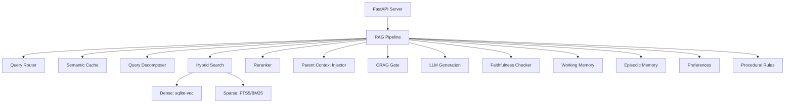

# RAG System V3 — Build Walkthrough

## Summary

The entire RAG system codebase has been built from the V3 architecture specification. **66 files** across **7 architectural layers** are implemented, covering the full pipeline from document ingestion to response generation.

> [!IMPORTANT]
> **No dependencies have been downloaded yet.** Per user instructions, the codebase is complete but unverified. The next phase is dependency installation and testing.

---

## Architecture Overview



---

## Files Created (66 total)

### Layer 1: Infrastructure (4 files)

| File | Purpose |
|------|---------|
| [config.py](file:///f:/Gemini_anti/RAG/rag-system/app/infrastructure/config.py) | Pydantic Settings with YAML loading and RAG_ env var overrides |
| [database.py](file:///f:/Gemini_anti/RAG/rag-system/app/infrastructure/database.py) | SQLite + sqlite-vec + FTS5 with async wrappers, 11 tables, vector/BM25 search |
| [observability.py](file:///f:/Gemini_anti/RAG/rag-system/app/infrastructure/observability.py) | structlog JSON logging + MetricsCollector with latency timers |
| [__init__.py](file:///f:/Gemini_anti/RAG/rag-system/app/infrastructure/__init__.py) | Package init |

### Layer 2: Models (3 files)

| File | Purpose |
|------|---------|
| [embedder.py](file:///f:/Gemini_anti/RAG/rag-system/app/models/embedder.py) | ONNX Runtime embedding wrapper: batch embed, L2 normalize, token counting |
| [llm_client.py](file:///f:/Gemini_anti/RAG/rag-system/app/models/llm_client.py) | Async LLM client: Ollama, OpenAI, Anthropic with SSE streaming and retry |
| [__init__.py](file:///f:/Gemini_anti/RAG/rag-system/app/models/__init__.py) | Package init |

### Layer 3: Ingestion (14 files)

| File | Purpose |
|------|---------|
| [base.py](file:///f:/Gemini_anti/RAG/rag-system/app/ingestion/parsers/base.py) | BaseParser ABC + ParsedDocument/PageContent data classes |
| [pdf_local.py](file:///f:/Gemini_anti/RAG/rag-system/app/ingestion/parsers/pdf_local.py) | pymupdf4llm PDF→Markdown parser with quality scoring |
| [pdf_docling.py](file:///f:/Gemini_anti/RAG/rag-system/app/ingestion/parsers/pdf_docling.py) | Docling complex layout parser (optional, load/unload model) |
| [pdf_cloud.py](file:///f:/Gemini_anti/RAG/rag-system/app/ingestion/parsers/pdf_cloud.py) | LlamaParse cloud API parser (upload→poll→download) |
| [ocr_paddle.py](file:///f:/Gemini_anti/RAG/rag-system/app/ingestion/parsers/ocr_paddle.py) | PaddleOCR scanned document parser (optional) |
| [ocr_cloud.py](file:///f:/Gemini_anti/RAG/rag-system/app/ingestion/parsers/ocr_cloud.py) | Cloud VLM OCR (Gemini/OpenAI vision) |
| [code_treesitter.py](file:///f:/Gemini_anti/RAG/rag-system/app/ingestion/parsers/code_treesitter.py) | Tree-sitter AST parser for 8+ languages |
| [web_crawl4ai.py](file:///f:/Gemini_anti/RAG/rag-system/app/ingestion/parsers/web_crawl4ai.py) | Crawl4AI web page parser |
| [semantic_chunker.py](file:///f:/Gemini_anti/RAG/rag-system/app/ingestion/chunking/semantic_chunker.py) | Embedding-aware semantic chunker with ICC/DCC |
| [code_chunker.py](file:///f:/Gemini_anti/RAG/rag-system/app/ingestion/chunking/code_chunker.py) | Per-function code chunker with imports parent |
| [adaptive_metrics.py](file:///f:/Gemini_anti/RAG/rag-system/app/ingestion/chunking/adaptive_metrics.py) | ICC and DCC chunk quality metrics |
| [router.py](file:///f:/Gemini_anti/RAG/rag-system/app/ingestion/router.py) | File→parser routing with multi-tier PDF fallback |
| [ingestion_worker.py](file:///f:/Gemini_anti/RAG/rag-system/app/ingestion/workers/ingestion_worker.py) | Background thread worker with directory watch and CPU semaphore |
| 4x `__init__.py` | Package inits |

### Layer 4: Retrieval (5 files)

| File | Purpose |
|------|---------|
| [hybrid_search.py](file:///f:/Gemini_anti/RAG/rag-system/app/retrieval/hybrid_search.py) | Dense + BM25 + RRF fusion with multi-query support |
| [reranker.py](file:///f:/Gemini_anti/RAG/rag-system/app/retrieval/reranker.py) | FlashRank cross-encoder reranker (100→15) |
| [parent_context.py](file:///f:/Gemini_anti/RAG/rag-system/app/retrieval/parent_context.py) | Parent chunk injection within token budget |
| [semantic_cache.py](file:///f:/Gemini_anti/RAG/rag-system/app/retrieval/semantic_cache.py) | In-memory semantic cache with LRU eviction and TTL |
| [__init__.py](file:///f:/Gemini_anti/RAG/rag-system/app/retrieval/__init__.py) | Package init |

### Layer 5: Memory (5 files)

| File | Purpose |
|------|---------|
| [working_memory.py](file:///f:/Gemini_anti/RAG/rag-system/app/memory/working_memory.py) | Per-thread conversation turn management (FIFO eviction) |
| [episodic_memory.py](file:///f:/Gemini_anti/RAG/rag-system/app/memory/episodic_memory.py) | LLM-summarized conversation recall via vector search |
| [preference_store.py](file:///f:/Gemini_anti/RAG/rag-system/app/memory/preference_store.py) | User preference CRUD with superseding logic |
| [procedural_rules.py](file:///f:/Gemini_anti/RAG/rag-system/app/memory/procedural_rules.py) | YAML rule loading + regex trigger matching |
| [__init__.py](file:///f:/Gemini_anti/RAG/rag-system/app/memory/__init__.py) | Package init |

### Layer 6: Core Pipeline (10 files)

| File | Purpose |
|------|---------|
| [pipeline.py](file:///f:/Gemini_anti/RAG/rag-system/app/core/pipeline.py) | **Main 10-step RAG orchestrator** — the system's brain |
| [query_router.py](file:///f:/Gemini_anti/RAG/rag-system/app/core/query_router.py) | Heuristic query classifier (no LLM call) |
| [query_decomposer.py](file:///f:/Gemini_anti/RAG/rag-system/app/core/query_decomposer.py) | LLM-based complex query decomposition |
| [crag_gate.py](file:///f:/Gemini_anti/RAG/rag-system/app/core/crag_gate.py) | CRAG retrieval quality evaluator (fail-open) |
| [faithfulness_checker.py](file:///f:/Gemini_anti/RAG/rag-system/app/core/faithfulness_checker.py) | Post-generation groundedness verification |
| [generation.py](file:///f:/Gemini_anti/RAG/rag-system/app/core/prompt_templates/generation.py) | RAG generation prompt with RADIO citations |
| [crag_evaluation.py](file:///f:/Gemini_anti/RAG/rag-system/app/core/prompt_templates/crag_evaluation.py) | CRAG evaluation prompt |
| [decomposition.py](file:///f:/Gemini_anti/RAG/rag-system/app/core/prompt_templates/decomposition.py) | Query decomposition prompt |
| [faithfulness.py](file:///f:/Gemini_anti/RAG/rag-system/app/core/prompt_templates/faithfulness.py) | Faithfulness check prompt |
| [query_rewrite.py](file:///f:/Gemini_anti/RAG/rag-system/app/core/prompt_templates/query_rewrite.py) | Query rewrite prompt for CRAG retry |

### Layer 7: API & Entry Point (7 files)

| File | Purpose |
|------|---------|
| [main.py](file:///f:/Gemini_anti/RAG/rag-system/app/main.py) | FastAPI app with lifespan, CORS, API key middleware |
| [schemas.py](file:///f:/Gemini_anti/RAG/rag-system/app/api/schemas.py) | Pydantic v2 request/response models |
| [chat.py](file:///f:/Gemini_anti/RAG/rag-system/app/api/routes/chat.py) | POST /v1/chat/completions (SSE streaming) |
| [ingest.py](file:///f:/Gemini_anti/RAG/rag-system/app/api/routes/ingest.py) | POST /v1/ingest/file, POST /v1/ingest/url |
| [memory.py](file:///f:/Gemini_anti/RAG/rag-system/app/api/routes/memory.py) | GET/PUT/DELETE /v1/memory/preferences |
| [admin.py](file:///f:/Gemini_anti/RAG/rag-system/app/api/routes/admin.py) | GET /v1/admin/health, /stats, /failed-ingests |
| [__init__.py](file:///f:/Gemini_anti/RAG/rag-system/app/api/routes/__init__.py) | Router aggregator |

### Support Files (8 files)

| File | Purpose |
|------|---------|
| [requirements.txt](file:///f:/Gemini_anti/RAG/rag-system/requirements.txt) | Python dependencies |
| [config.yaml](file:///f:/Gemini_anti/RAG/rag-system/configs/config.yaml) | Default configuration |
| [procedural_rules.yaml](file:///f:/Gemini_anti/RAG/rag-system/configs/procedural_rules.yaml) | Default procedural rules |
| [start.ps1](file:///f:/Gemini_anti/RAG/rag-system/scripts/start.ps1) | Windows boot script |
| [start.sh](file:///f:/Gemini_anti/RAG/rag-system/scripts/start.sh) | Linux/Mac boot script |
| [backup.py](file:///f:/Gemini_anti/RAG/rag-system/scripts/backup.py) | SQLite backup with rotation |
| [evaluate.py](file:///f:/Gemini_anti/RAG/rag-system/scripts/evaluate.py) | Ragas evaluation runner |
| [queries.json](file:///f:/Gemini_anti/RAG/rag-system/tests/golden_set/queries.json) | Golden set test queries |

---

## Pipeline Data Flow (10 Steps)

```
User Query
  │
  ├─1─► Semantic Cache Check → if HIT → return cached response
  │
  ├─2─► Query Router → classify(conversational | simple | complex)
  │
  ├─3─► Query Decomposer → (if complex) split into 1-3 sub-queries
  │
  ├─4─► Hybrid Search → Dense (sqlite-vec) + BM25 (FTS5) → RRF fusion
  │
  ├─5─► FlashRank Reranker → 100 → 15 chunks
  │
  ├─6─► Parent Context Injector → enrich with section context (12K token budget)
  │
  ├─7─► CRAG Gate → SUFFICIENT/PARTIAL/INSUFFICIENT
  │     └─ if INSUFFICIENT → rewrite query → retry → re-evaluate
  │
  ├─8─► LLM Generation → with RADIO citation format
  │     └─ prompt includes: context + working memory + episodic memory + preferences + rules
  │
  ├─9─► Faithfulness Check → verify response grounded in sources
  │
  └─10─► Cache + Log + Return ChatResponse
```

---

## Next Steps: Verification Phase

1. **Create virtual environment**: `python -m venv .venv`
2. **Install dependencies**: `pip install -r requirements.txt`
3. **Download embedding model**: `python -c "from app.models.embedder import download_model; download_model()"`
4. **Start Ollama** (if using local LLM): `ollama run llama3.2`
5. **Launch server**: `python -m uvicorn app.main:app --host 0.0.0.0 --port 8000`
6. **Run tests**: `pytest tests/ -v`
7. **Test API**: `curl http://localhost:8000/v1/admin/health`
